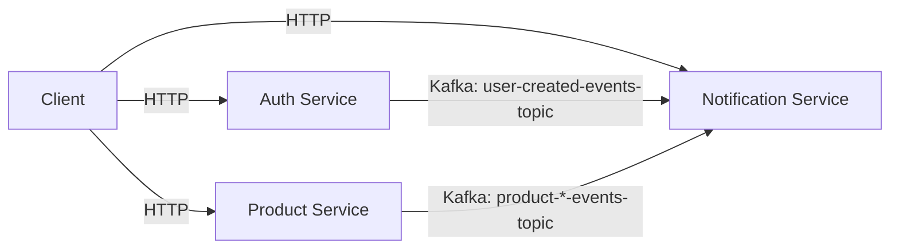

# ProductManager

Microservice-based product management system with notifications built on Spring Boot and Kafka.

## Table of Contents
- [Technology Stack](#-technology-stack)
- [System Architecture](#-system-architecture)
- [API Endpoints](#-api-endpoints)
- [Kafka Topics](#-kafka-topics)
- [Getting Started](#-getting-started)
- [Request Examples](#-request-examples)
- [Logging](#-logging)

---

## Technology Stack
- **Core**:
  - Java 21
  - Spring Boot 3.x
  - Spring Web
  - Spring Security + JWT
  - Spring Data JPA
- **Messaging**:
  - Apache Kafka (KRaft mode)
- **Database**:
  - PostgreSQL
- **Utilities**:
  - Lombok
  - Log4j2
- **Infrastructure**:
  - Docker (Kafka cluster)

---

## System Architecture

---

## API Endpoints
 - Auth Service

|Method |	Endpoint      |	Description                |	Required Role|
|-------|---------------|----------------------------|---------------|
|POST   |	`/auth`       |	Authentication (JWT token) |	-            |
|POST   |`/registration`|	User registration          |	-            |
|GET    |	`/users`      |	Get all users              |	ADMIN        |
|GET    |	`/info`       |	Get current user info      |	USER/ADMIN   |

 - Product Service

|Method | Endpoint|	Description        |	Required Role|
|-------|---------|----------------------|---------------|
|GET    |	`/all`  |	Get all products     |	-            |
|GET    |	`/{id}` |	Get specific product |	-            |
|POST   |`/create`|	Create new product   |	ADMIN        |
|PATCH  |`/{id}`  |	Update product       |	ADMIN        |
|DELETE |`/{id}`  |	Delete product       |	ADMIN        |

 - Notification Service

|Method |	Endpoint            |	Description                     | Required Role    |
|-------|---------------------|---------------------------------|------------------|
|PATCH  |	`/notification-set` |	Configure notification settings | any, Authtorized |

---

# Kafka Topics
|Topic Name                   |	Event Type       |	Handler Class       |
|-----------------------------|------------------|----------------------|
|user-created-events-topic    |	User creation    |	UserEventsHandler   |
|product-created-events-topic |	Product creation |	ProductEventsHandler|
|product-updated-events-topic |	Product update   |	ProductEventsHandler|
|product-deleted-events-topic |	Product deletion |	ProductEventsHandler|

---

## Getting Started
1. Start Kafka Cluster

```bash
docker-compose -f kafka-docker-compose.yml up -d
```

2. Run Services

- Auth Service
```bash
./mvnw spring-boot:run -pl auth-service
```

- Product Service
```bash
./mvnw spring-boot:run -pl product-service
```

- Notification Service
```bash
./mvnw spring-boot:run -pl notification-service
```

---

## Request Examples
- User Registration:

```http
POST /registration
Content-Type: application/json

{
  "username": "admin",
  "email": "admin@example.com",
  "password": "password",
  "confirm_password": "password"
}
```
- Product Creation:

```http
POST /create
Authorization: Bearer {JWT_TOKEN}
Content-Type: application/json

{
  "name": "iPhone 15",
  "price": 999.99
}
```

---

## Logging

All services use Log4j2 with output to:
Console
